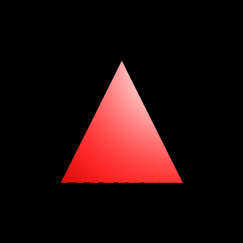
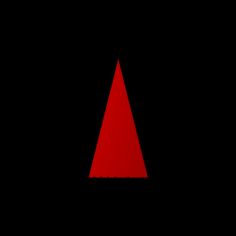
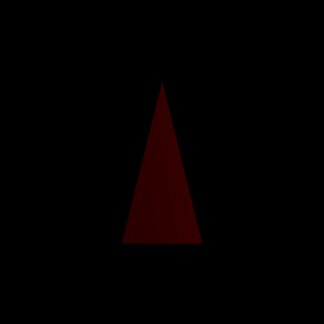
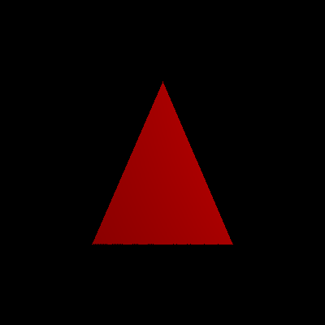

# EPL607 - Project Part 3


## Introduction
In this Project, we create a python program which receives the 3D coordinates of one triangle and 
generates a series of PNG images that can later compose an MP4 animated video. This video displays
a red triangle which is shaded with local illumination, rotating around itself.


## Members
- Antonis Katsiantonis
- Nikolas Vattis


## Programming Language and Libraries
For the implementation of the second part of this project we decided to use the same programming 
language (python) and library (pillow). Additionally, we will use the library numpy.


## Entities

For this part of the project we will need to operate on different entities, such as the Triangle, the
Light source, etc. For this reason, we decided to create classes for each of these entities. In this 
section we will discuss the attributes and behavior of each of these entities.


### Vector

For this part of the project, we needed to create a Vector entity, in order to be able to hold 3-dimensional
vectors, which will then be used to compose more complex entities. Initially, we want a vector to store a 
value for each of the x, y and z coordinates. Then, we want to implement all the operations that we want to
use between two vectors, such as addition, multiplication, dot product, normalization, etc. This entity will 
also be used to represent points in our coordinates, and will also represent colors where the x, y and z values 
will represent the red, green and blue colors respectively.


### Light

Now that we have the Vector entity, we can also implement our Light entity, which will be defined by a position
in our coordinates, and by the color that the light emits. Both of these attributes can be represented by our 
Vector entity that we introduced in the previous section.


### Material

Material is another entity which can be implemented using Vectors. In order to represent the Material entity we
will need to define it's diffuse and specular reflection, and also it's shininess. The diffuse and specular 
reflections can be defined by vectors, having a value for each of the RGB colors. The shininess is represented 
with a decimal number.


### Triangle

Now that we have the Vector and Material entities implemented, we want to create our Triangle entity, which 
mainly holds two types of information: The 3D points for each triangle vertices, and the Material of the triangle.
The positions of the vertices and the material will be represented by the Vector and Material entities respectively.


## Transformations

One of the additions that we chose to implement for this project is the Transformation, where our Triangle is being 
transformed using the transformations that we learned in the class: Translation, Rotation, Scaling. We define 
the transformation matrices in our project and use the python's matrix multiplication operation to multiply 
our base triangle to retrieve the transformed triangle.


## Projection
In order to transform our shapes from 3D to 2D, we need to apply Perspective Projection into our 
shapes. This operation is discussed in more detail in the second part of this project.


## Rasterization
Now that we have the 2D coordinates of our shapes, we now want to color the inside of our shapes.
In order to do this, we need to take 2 things into consideration for each Pixel:

* Is the pixel inside the shape? (We use edge function to determine this)
* Is the pixel covered by another shape? (We use z-buffer to determine this)

For each point of the triangle, if we find
that the point is inside the triangle (w0 >= 0 and w1 >= 0 and w2 >= 0), then the only condition
left to check is for other shapes that might be covering the pixel that we want to draw. The way
we check this is by holding a z-buffer which holds the closest object for each pixel. So for our
pixel, if the z value of our pixel is closer to the z value of the z-buffer (iterations of 
previous shapes), then we should draw the pixel.


## Shading

Shading is the second addition that we chose to implement in the final part of this project, specifically
Local Illumination. Initially we start by calculating the 3D position of our pixel, in order to apply the 
Local Illumination formula on it. Then, we calculate the normal vector (perpendicular to the triangle's surface)
which will be used to calculate both the Diffuse and Specular illumination. For the specular illumination, we 
will also need to calculate the light and halfway vectors. After we calculate these vectors, we already have 
the light's illumination, and also the diffuse and specular reflectance of our triangle, so now we can run
the Local Illumination formula which will provide the color of our pixel.


## Bounding Box
The third addition we implemented is the bounding box, which reduces the time required to render the triangle.
Initially, we find the Bounding Box (minX, maxX, minY, maxY) of our triangle in order to minimize
the area that we will scan. Now that we have our Bounding Box, we will loop every pixel inside
it, and for each pixel we will run the edge function for each line of the triangle.

### Performance Comparison
In order to compare the difference in performance between bbox and no bbox solutions, we ran our code 5 times
for each scenario and retrieved the average of the execution times for each of one of them.

#### No Bounding Box
    Execution time: 12.330230000000004

    Execution time: 13.894848999999997

    Execution time: 12.862837000000003

    Execution time: 14.310848

    Execution time: 13.186808000000001

    Average Execution Time: 13.3171144

#### With Bounding Box

    Execution time: 7.493442
    
    Execution time: 7.607043000000001
    
    Execution time: 8.735713
    
    Execution time: 9.333058
    
    Execution time: 8.463237000000001
    
    Average Execution Time: 8.3264986

Our results indicate that the average run time of the b-box solution is 1.6 times faster than the solution that 
does not utilize b-boxes.


## Animation





For this project we implemented a loop which generates a separate image for each iteration. In each
iteration, we slightly change the angle of the rotation transformation, so that the images can be
combined to compose an animation of the triangle rotating around itself in the y coordinate. Specifically, 
we  created a loop of 60 iterations, in order to create 60 images which can be composed into the video of
the animation described above.


## Video Generation
In order to generate the video out of the images, we used the [ffmpeg](https://ffmpeg.org/) command as 
shown below:

```ffmpeg -framerate 24 -i frames/frame_%03d.png -c:v libx264 -pix_fmt yuv420p output.mp4```

This command utilizes the images generated by our code to generate the MP4 video.